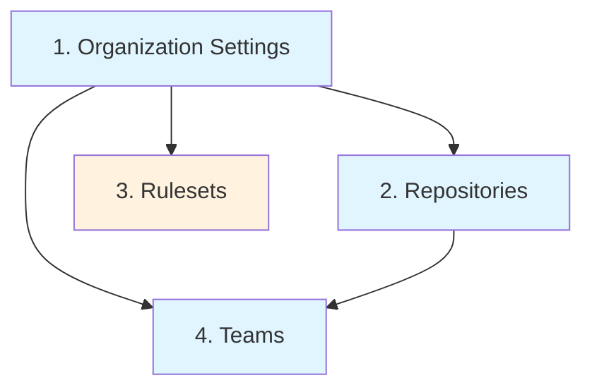

# Deployment Guide

This guide covers deploying all modules and managing them in different scenarios.

## Deployment Strategies

### Strategy 1: Individual Module Deployment (Recommended)

Deploy each module independently for maximum flexibility and isolation.

**Advantages:**
- ✅ Independent state files
- ✅ Isolated changes
- ✅ Easier troubleshooting
- ✅ Selective deployment
- ✅ Better for large organizations

### Strategy 2: Combined Deployment

Deploy all modules together using a wrapper or workspace.

**Advantages:**
- ✅ Single apply operation
- ✅ Simplified workflow
- ✅ Better for small organizations

## Individual Module Deployment

### Order of Deployment

Deploy in this recommended order:



1. **Organization Settings** - Foundation settings
2. **Repositories** - Create repositories
3. **Rulesets** - Apply organization rules (optional, requires Team/Enterprise)
4. **Teams** - Create teams and grant access

!!! info "Dependencies"
    Teams module may reference repositories, so deploy repositories first if granting team access.

### Deploying Organization Settings

```bash
cd org_configurations

# Configure locals.tf with your organization details

# Initialize
terraform init

# Plan
terraform plan

# Apply
terraform apply
```

### Deploying Repositories

```bash
cd repos

# Configure configs/repositories.yaml

# Initialize
terraform init

# Plan and review
terraform plan

# Apply
terraform apply
```

### Deploying Organization Rulesets (Optional)

!!! warning "Requires GitHub Team/Enterprise"
    Skip this if you don't have GitHub Team or Enterprise plan.

```bash
cd rulesets

# Configure configs/org_rulesets.yaml

# Initialize
terraform init

# Plan
terraform plan

# Apply
terraform apply
```

### Deploying Teams

```bash
cd teams

# Configure configs/teams.yaml

# Initialize
terraform init

# Plan
terraform plan

# Apply
terraform apply
```

## Remote State Management

### Why Use Remote State?

Remote state is essential for:

- **Team collaboration** - Multiple people working together
- **State locking** - Prevent concurrent modifications
- **Security** - Encrypted state storage
- **Backup** - Automatic state backup
- **CI/CD** - Access state from pipelines

### Option 1: Terraform Cloud

Create `backend.tf` in each module:

```hcl title="backend.tf"
terraform {
  backend "remote" {
    organization = "your-organization"

    workspaces {
      name = "github-repos"  # Different for each module
    }
  }
}
```

**Module workspace names:**
- Organization: `github-org-settings`
- Repositories: `github-repos`
- Rulesets: `github-rulesets`
- Teams: `github-teams`

### Option 2: S3 Backend (AWS)

```hcl title="backend.tf"
terraform {
  backend "s3" {
    bucket         = "your-terraform-state-bucket"
    key            = "github/repos/terraform.tfstate"  # Different for each module
    region         = "us-east-1"
    encrypt        = true
    dynamodb_table = "terraform-state-lock"
  }
}
```

**Module state keys:**
- Organization: `github/org/terraform.tfstate`
- Repositories: `github/repos/terraform.tfstate`
- Rulesets: `github/rulesets/terraform.tfstate`
- Teams: `github/teams/terraform.tfstate`

### Option 3: Azure Backend

```hcl title="backend.tf"
terraform {
  backend "azurerm" {
    resource_group_name  = "terraform-state-rg"
    storage_account_name = "terraformstate"
    container_name       = "tfstate"
    key                  = "github-repos.tfstate"  # Different for each module
  }
}
```

### Option 4: GCS Backend (Google Cloud)

```hcl title="backend.tf"
terraform {
  backend "gcs" {
    bucket = "your-terraform-state-bucket"
    prefix = "github/repos"  # Different for each module
  }
}
```

## Migrating to Remote State

If you started with local state, migrate to remote:

1. Add `backend.tf` configuration

2. Re-initialize with migration:
```bash
terraform init -migrate-state
```

3. Confirm migration when prompted:
```
Do you want to copy existing state to the new backend?
  Pre-existing state was found while migrating the previous "local" backend to the
  newly configured "remote" backend. No existing state was found in the newly
  configured "remote" backend. Do you want to copy this state to the new "remote"
  backend? Enter "yes" to copy and "no" to start with an empty state.

  Enter a value: yes
```

## Workspace Strategy

Use workspaces for multiple environments:

```bash
# Create workspaces
terraform workspace new dev
terraform workspace new staging
terraform workspace new prod

# Switch workspace
terraform workspace select prod

# List workspaces
terraform workspace list
```

Configure environment-specific values:

```hcl title="locals.tf"
locals {
  environment = terraform.workspace

  repos = yamldecode(file(
    "${path.module}/configs/repositories-${local.environment}.yaml"
  ))
}
```

File structure:
```
configs/
├── repositories-dev.yaml
├── repositories-staging.yaml
└── repositories-prod.yaml
```

## CI/CD Deployment

### GitHub Actions

Create `.github/workflows/terraform.yml`:

```yaml title=".github/workflows/terraform.yml"
name: Terraform

on:
  push:
    branches: [main]
  pull_request:
    branches: [main]

env:
  GITHUB_TOKEN: ${{ secrets.TERRAFORM_GITHUB_TOKEN }}

jobs:
  terraform-repos:
    name: Terraform - Repositories
    runs-on: ubuntu-latest
    defaults:
      run:
        working-directory: repos

    steps:
      - name: Checkout
        uses: actions/checkout@v4

      - name: Setup Terraform
        uses: hashicorp/setup-terraform@v3
        with:
          terraform_version: 1.6.0

      - name: Terraform Format
        run: terraform fmt -check

      - name: Terraform Init
        run: terraform init

      - name: Terraform Validate
        run: terraform validate

      - name: Terraform Plan
        run: terraform plan -no-color
        continue-on-error: true

      - name: Terraform Apply
        if: github.ref == 'refs/heads/main' && github.event_name == 'push'
        run: terraform apply -auto-approve

  terraform-teams:
    name: Terraform - Teams
    runs-on: ubuntu-latest
    needs: terraform-repos  # Deploy after repos
    defaults:
      run:
        working-directory: teams

    steps:
      - name: Checkout
        uses: actions/checkout@v4

      - name: Setup Terraform
        uses: hashicorp/setup-terraform@v3
        with:
          terraform_version: 1.6.0

      - name: Terraform Init
        run: terraform init

      - name: Terraform Plan
        run: terraform plan -no-color

      - name: Terraform Apply
        if: github.ref == 'refs/heads/main' && github.event_name == 'push'
        run: terraform apply -auto-approve
```

### GitLab CI

Create `.gitlab-ci.yml`:

```yaml title=".gitlab-ci.yml"
variables:
  GITHUB_TOKEN: $GITHUB_TOKEN

stages:
  - validate
  - plan
  - apply

.terraform-base:
  image: hashicorp/terraform:1.6
  before_script:
    - cd $MODULE_DIR
    - terraform init

terraform-repos-validate:
  extends: .terraform-base
  stage: validate
  variables:
    MODULE_DIR: repos
  script:
    - terraform fmt -check
    - terraform validate

terraform-repos-plan:
  extends: .terraform-base
  stage: plan
  variables:
    MODULE_DIR: repos
  script:
    - terraform plan -out=plan.tfplan
  artifacts:
    paths:
      - repos/plan.tfplan

terraform-repos-apply:
  extends: .terraform-base
  stage: apply
  variables:
    MODULE_DIR: repos
  script:
    - terraform apply plan.tfplan
  dependencies:
    - terraform-repos-plan
  only:
    - main
  when: manual
```

## Update Workflow

### Making Changes

1. **Edit configuration files** (YAML files)

2. **Plan changes**:
```bash
terraform plan
```

3. **Review the plan carefully**

4. **Apply if satisfied**:
```bash
terraform apply
```

### Rolling Back Changes

#### Option 1: Revert Configuration

1. Revert your YAML changes:
```bash
git revert HEAD
```

2. Apply the reverted configuration:
```bash
terraform apply
```

#### Option 2: Use State File

1. List state history (if using Terraform Cloud):
```bash
terraform state list
```

2. Manually adjust configuration to previous state

### Selective Apply

Target specific resources:

```bash
# Apply only a specific repository
terraform apply -target='github_repository.repos["specific-repo"]'

# Apply specific team
terraform apply -target='github_team.teams["platform-team"]'
```

!!! warning "Use Sparingly"
    Targeted applies should only be used in exceptional circumstances.

## Drift Detection

Detect manual changes made outside Terraform:

```bash
# Check for drift
terraform plan -detailed-exitcode

# Exit codes:
# 0 = No changes
# 1 = Error
# 2 = Changes detected
```

### Automated Drift Detection

GitHub Actions example:

```yaml
- name: Detect Drift
  run: |
    terraform plan -detailed-exitcode
    if [ $? -eq 2 ]; then
      echo "::warning::Configuration drift detected!"
    fi
```

## Best Practices

### 1. Always Plan Before Apply

```bash
# ✅ Good
terraform plan
# Review output
terraform apply

# ❌ Bad
terraform apply -auto-approve  # Only for CI/CD
```

### 2. Use Version Control

Commit all configuration changes:

```bash
git add configs/repositories.yaml
git commit -m "Add new repository for project X"
git push
```

### 3. Review Plans in PRs

Configure CI to comment plan output on PRs.

### 4. Lock State During Changes

Remote backends automatically handle locking:

```
Acquiring state lock. This may take a few moments...
```

If someone else is applying:
```
Error: Error locking state: resource temporarily unavailable
```

### 5. Use Workspaces or Separate State Files

For multiple environments:

```bash
# Option 1: Workspaces
terraform workspace select prod

# Option 2: Separate directories
cd environments/prod
```

### 6. Test in Development First

Always test changes in dev before production:

```bash
# Test in dev
cd repos
terraform workspace select dev
terraform apply

# Verify in GitHub

# Apply to prod
terraform workspace select prod
terraform apply
```

### 7. Document Changes

Add comments in YAML:

```yaml
repositories:
  critical-service:
    # PROD-1234: Increased approvals for compliance
    rulesets:
      main-protection:
        rules:
          pull_request:
            required_approving_review_count: 2  # Was 1
```

## Troubleshooting

### State Lock Timeout

```
Error: Error locking state: resource temporarily unavailable
```

**Solutions:**
1. Wait for other operation to complete
2. Force unlock (only if stuck): `terraform force-unlock LOCK_ID`

### Backend Initialization Failed

```
Error: Failed to get existing workspaces
```

**Solutions:**
1. Check backend configuration
2. Verify credentials
3. Ensure backend resources exist

### Plan Shows Unexpected Changes

Review what's different:

```bash
# Show detailed diff
terraform show

# Refresh state
terraform refresh
```

## Next Steps

- [Getting Started](getting-started.md) - Deploy your first configuration
- [Examples](../examples/basic-setup.md) - See deployment patterns
- [Best Practices](../examples/best-practices.md) - Advanced tips
