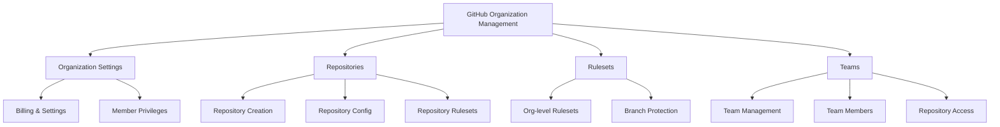
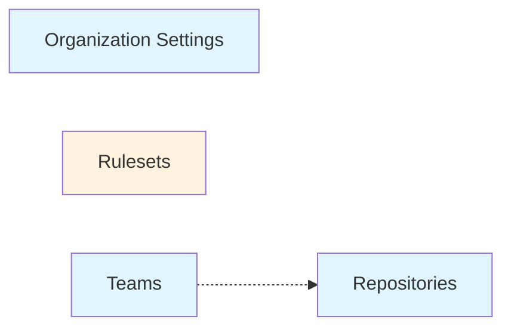

# Repository Overview

This repository demonstrates how to manage GitHub organizations using Infrastructure as Code (IaC) principles with Terraform and the GitHub provider.

## Architecture

The repository is organized into four independent Terraform modules, each managing a specific aspect of GitHub organization management:



## Module Structure

Each module follows a consistent structure:

```
module_name/
├── main.tf          # Resource definitions
├── locals.tf        # Configuration loading and data transformation
├── variables.tf     # Input variables
├── outputs.tf       # Output values
├── providers.tf     # Provider configuration
├── backend.tf       # Terraform backend configuration
└── configs/         # YAML configuration files
    └── *.yaml       # Configuration data
```

## Configuration Approach

All modules use **YAML-based configuration** for ease of maintenance:

- Human-readable format
- Easy to version control
- Simple to review in pull requests
- Clear separation between code and configuration
- Support for comments and documentation

## Terraform Resources

The modules use the following main Terraform resources:

| Module | Primary Resources |
|--------|------------------|
| Organization Settings | `github_organization_settings` |
| Repositories | `github_repository`, `github_repository_ruleset` |
| Rulesets | `github_organization_ruleset` |
| Teams | `github_team`, `github_team_membership`, `github_team_repository` |

## Key Design Principles

### 1. Modularity

Each module can be deployed independently. You don't need to deploy all modules - only the ones relevant to your use case.

### 2. Safe Defaults

All modules use Terraform's `try()` function to provide sensible defaults for optional parameters, reducing configuration overhead.

### 3. YAML Configuration

Configuration is separated from Terraform code, making it easier for non-technical users to manage settings.

### 4. Idempotency

All configurations are idempotent - you can run `terraform apply` multiple times safely.

### 5. Free Tier Compatibility

Repository-level rulesets work on public repositories with GitHub Free tier. Organization-level features are clearly marked when they require Team/Enterprise plans.

## Module Dependencies

The modules have minimal dependencies on each other:



!!! note "Dependency Notes"
    - **Teams** module optionally depends on **Repositories** (only if granting team access to repos)
    - **Rulesets** (org-level) requires GitHub Team/Enterprise plan
    - All other modules are independent and can be deployed in any order

## Next Steps

- [Prerequisites](prerequisites.md) - Set up your environment
- [Modules Documentation](modules/organization.md) - Deep dive into each module
- [Getting Started Guide](guides/getting-started.md) - Deploy your first configuration
